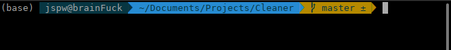

# git-101

## Beginner

## Full Examples

- Create a repository : Create a empty repository in github.

Then open git bash in your local pc

- init project : `git init` (initializing our repository)

For example lets add something in our repo. Let's add a file called readme.md. You can create a file using your GUI(Graphical user interface) like in FileManager, right click on mouse and file or folder creation options will be popped up. Or you can use your shell/bash to create the file.

    As i'm a linux user and taking flex in front of you, i will create md file using my oh-my-zsh(a bash terminal).

- create a file in bash : `touch README.md` (this will create a empty file named README.md in the directory you are in now, you can check current directory using `pwd` in terminal). You can add some content in it.

Now we have created a file and we want to add it into our repository. It does exist in our local pc not in github server [check if you don't believe me :)].
To upload it we need to follow some stuffs -> ['add','commit','push'].Let's do it.

- Add a file in repo : `git add README.md`.

If you are curious enough and lazy :D then you must be thinking of adding 100 files/folder will fuck our hand and mind ! Actually we can add all files or files with same extension or file starting or ending with same substring and so on!

- Add add files in the current dir : `git add .` (a dot actually can save your life :3)
- Commit changes : `git commit -m "short but meaningful commit message" -m "description can be added but its optional"`

According to my previous statement we need to push the commit but there is a small thing we need to do as this is repo we want to connect with e github server repository we have created at first. So we need to make a link for the first time. Before that we will change/move/rename the branch name. If your are in a terminal you may be notice that the default branch is master now.

In the screenshot you can see some colorful text.Forgot about the first text `(base)` its a different stuff to describe (not related to git). After (base) next things are my `username@pc_name>working_directory>git_branch_name` accordingly.
We here my branch name is `master`

We will change the default branch name to `main` according to github's preference.

- rename branch : `git branch -M main` (we will learn more about branch command later)

Now we need to link our local repo with github server somehow !

- `git remote add origin https://github.com/your_username/github_repository_name`

by this command we are creating a origin / we are adding a location of our remote repository where we will push our file or pull files from.

- push code to github : `git push origin main` (as our branch name is main)

## Intermediate

## Advance
